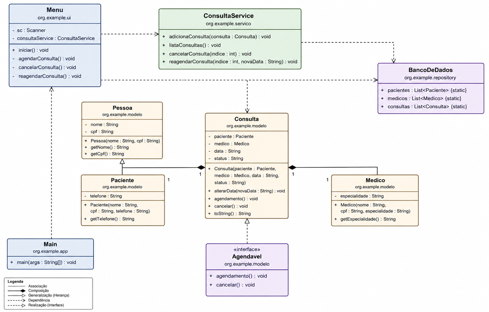

# 🏥 Sistema de Gerenciamento de Consultas Médicas

## Descrição do Projeto

Este projeto consiste em um sistema simples de gerenciamento de consultas médicas desenvolvido em Java. A aplicação funciona por meio de um menu no terminal e permite que o usuário realize o cadastro de pacientes e médicos durante o agendamento da consulta, além de listar, reagendar e cancelar consultas.

O principal objetivo do projeto foi colocar em prática os conceitos estudados na disciplina de Programação Orientada a Objetos, utilizando classes, herança, interfaces, encapsulamento, polimorfismo e coleções.

## Problema

Em uma clínica, controlar consultas manualmente pode gerar alguns problemas, como perda de informações, dificuldade para localizar consultas e falta de organização no agendamento.

Pensando nisso, foi desenvolvido um sistema simples para facilitar esse controle, permitindo cadastrar consultas e realizar alterações sempre que necessário.

## Solução Proposta

O sistema oferece as seguintes funcionalidades:

- Cadastro de pacientes;
- Cadastro de médicos;
- Agendamento de consultas;
- Listagem das consultas cadastradas;
- Reagendamento de consultas;
- Cancelamento de consultas.

Os dados são armazenados em memória utilizando listas (ArrayList), sem necessidade de banco de dados.

## Requisitos Funcionais
| Código | Descrição |
|--------|-----------|
| RF01 | Cadastrar pacientes. |
| RF02 | Cadastrar médicos. |
| RF03 | Agendar consultas. |
| RF04 | Listar consultas cadastradas. |
| RF05 | Reagendar consultas. |
| RF06 | Cancelar consultas. |

## Casos de Uso

### Caso de Uso 1 – Agendar Consulta

**Ator:** Usuário

**Objetivo:** Registrar uma nova consulta.

**Pré-condição:**

* O sistema deve estar em funcionamento.

**Fluxo principal:**

1. O usuário escolhe a opção **Agendar Consulta**.
2. O sistema solicita os dados do paciente.
3. O usuário informa os dados do paciente.
4. O sistema solicita os dados do médico.
5. O usuário informa os dados do médico.
6. O sistema solicita a data da consulta.
7. A consulta é criada com o status **Agendada**.
8. O sistema informa que a consulta foi cadastrada com sucesso.

**Pós-condição:**

* A consulta fica registrada na lista de consultas.

---

### Caso de Uso 2 – Listar Consultas

**Ator:** Usuário

**Objetivo:** Visualizar todas as consultas cadastradas.

**Pré-condição:**

* Não há.

**Fluxo principal:**

1. O usuário escolhe a opção **Listar Consultas**.
2. O sistema verifica se existem consultas cadastradas.
3. Caso existam, elas são exibidas na tela.
4. Caso contrário, o sistema informa que não existem consultas.

**Pós-condição:**

* Nenhuma informação é alterada.

---

### Caso de Uso 3 – Reagendar Consulta

**Ator:** Usuário

**Objetivo:** Alterar a data de uma consulta.

**Pré-condição:**

* Deve existir pelo menos uma consulta cadastrada.

**Fluxo principal:**

1. O usuário escolhe a opção **Reagendar Consulta**.
2. O sistema lista todas as consultas cadastradas.
3. O usuário seleciona uma consulta.
4. O usuário informa a nova data.
5. O sistema atualiza a data da consulta.
6. O sistema exibe uma mensagem de confirmação.

**Pós-condição:**

* A consulta permanece cadastrada com a nova data.

---
### Caso de Uso 4 – Cancelar Consulta

**Ator:** Usuário

**Objetivo:** Cancelar uma consulta.

**Pré-condição:**

* Deve existir pelo menos uma consulta cadastrada.

**Fluxo principal:**

1. O usuário escolhe a opção **Cancelar Consulta**.
2. O sistema lista todas as consultas.
3. O usuário seleciona a consulta desejada.
4. O sistema altera o status da consulta para **Cancelada**.
5. O sistema informa que a operação foi realizada com sucesso.

**Pós-condição:**

* A consulta permanece cadastrada com o status **Cancelada**.





## Como Executar o Projeto

### Pré-requisitos

* Java JDK 17 (ou superior) instalado.
* Apache Maven instalado.

### Clonar o repositório

```bash
git clone https://github.com/antonioJunior316/sistemaConsultasMedica.git
```

```bash
cd sistemaConsultasMedica
```

### Executar o projeto

No terminal, dentro da pasta do projeto, execute o comando:

```bash
mvn exec:java -Dexec.mainClass="org.example.app.Main"
```

Após a execução, o sistema será iniciado no terminal, exibindo o menu principal com as funcionalidades disponíveis, como cadastro de pacientes e médicos, agendamento, listagem, reagendamento e cancelamento de consultas.
